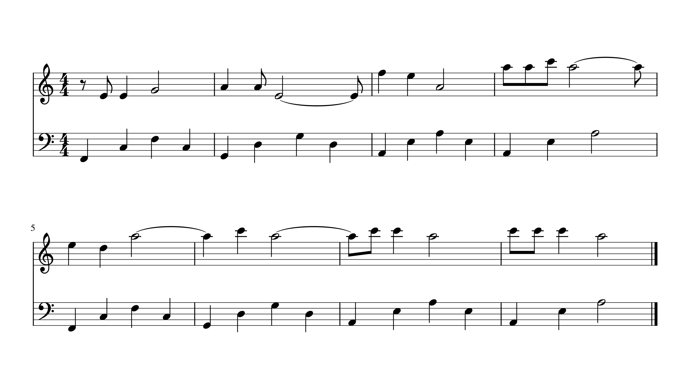
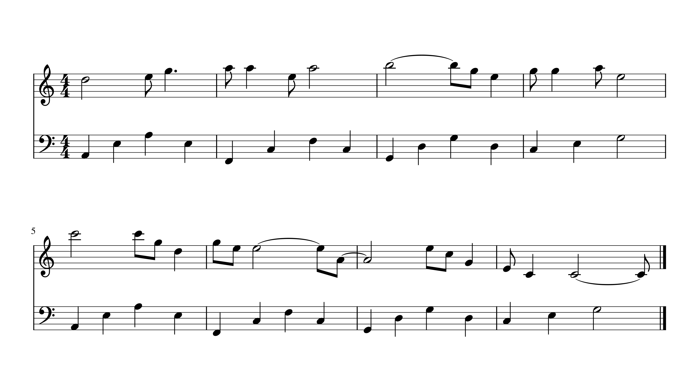
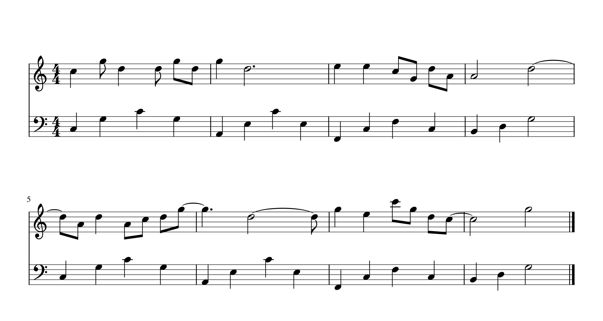

# 《音乐与数学》实验报告

**<p align=center>组号：4-25 <br/> 研究题: 机器作曲·遗传算法</p>**
**<p align=center>诸子瑜 陈风凌 孙靖皓 张洋 徐艺宁</p>**

---

## 实验概述

机器作曲是近年来人工智能领域的一个热门研究方向，
其中遗传算法被广泛应用于生成音乐旋律。
本实验旨在通过遗传算法生成音乐旋律，
通过对初始种群的遗传迭代，
探讨适应度函数的选取对最终音乐特性和算法效率的影响。

#### 成员分工

- **代码框架与训练**：陈风凌
- **音乐片段选取**：徐艺宁
- **数据预处理**：孙靖皓
- **适应度函数设计**：诸子瑜
- **代码内容完善**：张洋
- **实验报告**：共同完成

## 实验流程

### 工具与使用方法

我们使用 Python 语言中的 `music21` 第三方库来实现数据与乐谱之间的转换，
并用 `numpy` 库进行数据处理。

首先请确保 Python 版本在 `3.10` 或以上，
在终端输入 `python3 -V` 可以查看 Python 版本。
为安装必要的依赖，打开工作目录在终端执行
```sh
pip install numpy music21
```

我们使用 `.musicxml` 格式来储存乐谱文件，并使用 MuseScore 软件
查看乐谱和以 midi 形式播放乐谱。可以在其[官网](https://www.musescore.org)下载
安装最新版本的 MuseScore。

### 遗传算法简述

遗传算法（Genetic Algorithm, GA）是模拟达尔文生物进化论的自然选择
和遗传学机理的生物进化过程的计算模型，
是一种通过模拟自然进化过程搜索最优解的方法。

在模拟种群的迭代中，我们实现了对个体的交叉 (crossover), 变异 (mutation) 等操作。

- **交叉**操作：对于两个乐曲片段，我们随机选取一个截断点 $i$，
  将一个乐曲片段的前 $i$ 小节和另一片段的 $i$ 小节之后进行拼接。

- **变异**操作：包括改变单个音符音高、改变节奏型，以及对旋律进行
  移调 (translation)、倒影 (inversion)、逆行 (retrogration) 变换等。

### 初始种群选取

我们结合 “从具有相同节拍的若干歌曲、
乐曲中选取十个长度相等的片段” 与 “随机生成” 两种方法产生初始种群。
在选取乐曲片段时我们主要做了如下考虑：

1. 选定节拍为 4/4 拍。我们认为 4/4 拍是经典的平稳节奏型，大量受人喜爱的流行歌曲使用 4/4 拍，其旋律多具有悠长、叙事性强的特点。且小节内部“强-弱-次强-弱”的力度层次丰富，有较强的节奏感，容易被听众感知。

2. 为了保证旋律完整性，将长度设置为八小节。同时为保证调性一致，方便后续处理，将所有乐曲片段都进行了移调处理，得到C大调的初始种群。

3. 在具体挑选音乐片段时，主要考虑了节奏和旋律的丰富度，尽量减少样本内部的旋律重复。同时，选取了包含古典音乐、流行音乐在内的多种音乐风格，如《D大调卡农》、《青花瓷》等，使得初始种群的音乐丰富度提高。


### 设计适应函数

在遗传算法中，一个核心问题就是适应函数 (fitness function) 的设计。
在进一步学习乐理知识之后，我们设计了如下适应函数。
该适应度函数主要关注音高、音符时值、音高变化等方面的特征。主要考虑了两个部分：

##### 与给定音乐片段的比较
给定音乐片段是公认较为悦耳的曲目。同时考虑到遗传算法的机械性与程序化，我们挑选了节奏型较为规律、音高旋律易于评估的乐曲片段，使得算法能够更好地提取片段的特征，在有限的范围内给出一段音乐“好在哪里”的评价标准。我们主要从三个方面衡量与给定音乐的差异：

1. 比较两者整体音高的接近度。我们认为，好的音乐一般不会全部布局在过低音区或过高音区，而应该会主要分布于中音区到较高音区，因此将这个作为一个评估项。我们采取的方法是先计算两个片段的频率平均值，然后取绝对值差。

2. 比较两者整体音高起伏度之间的差异。好的音乐旋律上往往会有规律性的变化，有一定的起伏度，这恰好是遗传算法可以提取到并加以衡量的一个特征。我们采取的方法是先计算两者整体音高的方差，然后取绝对值差。

3. 比较两者细节上的接近度。这是一个“照葫芦画瓢”的机械操作，主要目的是希望遗传算法在开始的时候能较快地“步入正轨”，毕竟仅仅靠一些比较宽泛的标准很容易产生较大的偏差。我们采取的方法是比较二者每一个音的音高差，并求其绝对值和。

##### 对生成的音乐片段自行评估
这一部分不考虑给定的音乐，直接在生成音乐的基础上进行评估，形成一部分分值。我们也划分为了三个方面。

1. 衡量音乐片段的节奏复杂度。我们认为好的音乐具有较为丰富的节奏型。我们将音乐片段重新整合，计算出每个音符的长度存储进新的数组，然后对这个数组内的元素求方差，由此完成对节奏型的衡量。
$$
S_1 = c_1 \sqrt{\frac{1}{n}\sum _{\text{notes}} \text{duration}^2 - \left(\frac{1}{n}\sum _{\text{notes}}\text{duration}\right)^2}
$$

2. 衡量音乐片段中的突兀转音。为了让音乐片段里的音符不会转变突兀，使得片段听起来“呕哑嘲哳”，我们计算出每个音符之间的音程，并设定阈值为 5，也就是相邻音之间音程超过 5 个半音会被我们判定为音高变化过于突兀。我们计算突兀部分占整首曲子的比例，作为减分项。（当然，这也是考虑到算法作曲过于程式化的特点，诚然规定了这一项可能会使乐曲不那么“灵动”，但是却提升了生成乐曲的水平的“下限”。）
$$
S_2 = -c_2 \sum _{\text{note } i} f_2((|\text{duration} _i - \text{duration} _{i+1}| - 5) _+)
$$

3. 衡量音乐片段中的不和谐音符。我们考察了一些好听的片段，发现有些音符并不适合作结尾长音，比如 F、B。我们于是计算出 F、B 长音的数量，作为一个判断标准。由于这一标准有些主观，因此在最终分数中只占比较小的比例。
$$
S_3 = -c_3 \sum _{\text{F, B notes}} f_3(\text{duration})
$$


## 代码实现及各模块说明

我们的代码由 `main.py`, `population.py`, `preprocess.py`,
`constants.py`, `utils.py`, `randmusic.py`, `fitfunction.py` 组成。
其中 `constants.py` 定义了一些全局变量和文件路径，`utils.py` 中实现了
一些简单的帮助函数。

> 为了保持报告简洁性，以下展示的代码中可能会删去一些繁琐而不重要的细节处理。

### 数据处理

该模块主要在文件 `preprocess.py` 中实现。

我们定义了用于转换数据格式的 `Converter` 类。
该类包装了用于将音乐文件与数组之间进行转换的方法，
主要包括 `music2arrays`，`individual2music`，`array2music`，`generate_population`
四个方法。

- `music2arrays` 的功能是读取一个 musicxml 文件，将其中的音符流按音高和时值转化为一个二维数组，二维数组中的每一行包含 8 个整数，代表一个 4/4 拍小节中的 8 个八分音符，其中大于 0 的数字代表一个新的音符，而 $-1$ 代表当前音符的时值延长。
- `individual2music` 的功能是将一系列代表一段旋律的二维数组根据上述对应关系转化成 musicxml 文件，并存储于某个文件路径中。
- `array2music` 是 `individual2music` 的一个特殊情况，它只将一段单独的旋律转化为musicxml文件。
- `generate_population` 的功能是读取一系列 musicxml 文件中的旋律，并生成一组包含该旋律的二维数组，以作为遗传算法中的初始种群使用。

限于篇幅，这里仅展示其中 `individual2music`。
```py
# preprocess.py
def individual2music(self, result: Individual, file_path: str):
        stream = ms.stream.Part()
        for data in result.melody.ravel():
            if data in EXTEND:
                stream[-1].duration.quarterLength += 0.5
            else:
                note = ms.note.Note(data)
                note.duration.quarterLength = 0.5
                stream.append(note)

        if file_path == '':
            stream.show()
        elif file_path == 'return':
            return stream
        else:
            stream.write('xml', DATAPATH + file_path)
```

### 随机生成旋律

该模块主要在文件 `randmusic.py` 中实现。

由于完全随机生成的音乐通常较为难听，并且需要极多次迭代才能进化为较和谐的音乐，
我们在生成初始种群时遵循了一定的规律：

- 首先，音乐每小节的节奏型会从预先设定好的 10 种节奏型中随机选取，
  这样可以在保证节奏多样性的同时不至于混乱。
- 相邻的两个音符之间的音程不会超过纯五度，整个音乐片段的音程不会超过两个八度，
  这样可以控制旋律的稳定性，同时也会有一些跳跃音。
- 大部分的音高都会落在五声音阶内，减少不稳定的导音数量可以有效避免其落在强拍上的概率，
  让不和谐音未得到解决的情况减少出现次数。

```py
# randmusic.py
def update(note: int) -> int:
    if note < LOW:
        return note + random.randint(0, 3)
    if note > HIGH:
        return note + random.randint(-2, 1)
    return note + random.randint(-2, 3)

def generate_melody(start: int, rhythm_type: np.array):
    new = start
    nl = []
    for i in rhythm_type:
        new = update(new)
        nl.append(new)
        if i > 1:
            nl.extend([-1] * (i-1))
    nl = list(map(to_pitch, nl))
    return nl, new
```
接下来我们将生成出的片段使用 `music21` 库进行包装并保存为乐谱文件，以备使用。
```py
# randmusic.py
for i in range(20):
    fg = ms.stream.Part(gen_fg())
    fg.write('xml', './data/initial_' + str(i))
```

### 遗传算法主体

该模块主要在文件 `population.py` 中实现。
我们定义了用于模拟个体和种群的 `Individual` 类和 `Population` 类。

- **`Individual`类**

  该类用于模拟遗传算法中的个体，即一个音乐片段。
  每个个体包含一个二维数组 (`melody`)，用于表示音符的音高和时值。
  ```py
  # population.py
  class Individual:
      """ Individual music fragments """

      def __init__(self, melody: np.ndarray):
          self.melody = np.array(melody)
  ```
  我们在该类实现了个体的变异操作，包括前述的五种类型，
  其中改变音高会随机将一个音符的音高在大三度内调整，
  改变节奏型会随机延长、缩短一个音符，或将一个音符分裂为两个相同音高的音符：
  ```py
  # population.py
    def _modify_random_note(self) -> None:
        idx = tuple(np.random.randint(self.shape))
        while(self.melody[idx] in EXTEND):
            idx = tuple(np.random.randint(self.shape))

        offset = np.random.choice([-2, -1, 1, 2])
        if self.melody[idx] > HIGH:
            offset = np.random.choice([-2, -1])
        if self.melody[idx] < LOW:
            offset = np.random.choice([1, 2])
        self.melody[idx] = lift(self.melody[idx], offset)
  ```
  ```py
    def _change_rhythm(self) -> None:
        idx = np.random.randint(self.melody.size)
        temp = self.melody.ravel()[idx]

        c = np.random.choice([1, 2, 3])
        if c == 1:
            self.melody.ravel()[idx] = -1
            self.melody.ravel()[idx - 1] = temp
        elif c == 2:
            self.melody.ravel()[idx] = -1
            self.melody.ravel()[idx + 1] = temp
        elif c == 3:
            self.melody.ravel()[idx + 1] = temp
  ```

  值得一提的是，我们实现的移调、倒影和逆行操作都是在调内进行的，不会产生调外音。
  ```py
  # population.py
    def _transpose(self):
        m = np.random.randint(0, len(self))
        mask = self.melody[m] != -1
        self.melody[m][mask] += np.random.randint(-4, 5)
        self.melody[m][mask] = np.array(list(map(fit_scale, self.melody[m][mask])))

    def _retrograde(self):
        m = np.random.randint(0, len(self))
        mask = self.melody[m] != -1
        self.melody[m][mask] = self.melody[m][mask][::-1]

    def _inverse(self):
        m = np.random.randint(0, len(self))
        mask = self.melody[m] != -1
        self.melody[m][mask] = 2 * int(self.melody[m][mask].mean())
            - self.melody[m][mask]
        self.melody[m][mask] = np.array(list(map(fit_scale, self.melody[m][mask])))
  ```

- **`Population`类**

  该类用于模拟遗传算法中的种群，它包含一个个体列表以及适应度函数、变异率等属性。
  ```py
  # population.py
    class Population:
    """ Population of music fragments to apply genetic algorithm """

        def __init__(self, members: list[Individual],
                fitfunc: callable, mutate_rate: float):
            self._members = members
            self.fitfunc = fitfunc
            self.mutate_rate = mutate_rate
            self._adaptibilty = np.array(list(map(self.fitfunc, self._members)))
  ```
  在种群的每一次迭代中，我们会选择适应度较高的个体，用它们交叉产生新的个体，
  再按照预先设定的变异率来执行变异操作。
  ```py
  # population.py
    def cross(self) -> None:
        """
        Generate the next generation randomly
        """
        new_generation = []
        parents = self._select_best(len(self) // 3)
        for _ in range(len(self)):
            parent1 = np.random.choice(parents)
            parent2 = np.random.choice(parents)
            child = self._cross(parent1, parent2)
            new_generation.append(child)

        self.set_members(new_generation)
  ```
  ```py
    def mutate(self) -> None:
        """
        Apply mutation on some individuals
        """
        mutation_indices = np.random.rand(len(self._members)) < self.mutate_rate
        for i, mutate_flag in enumerate(mutation_indices):
            if mutate_flag:
                self._members[i].mutate()
                self._adaptibilty[i] = self.fitfunc(self._members[i])
  ```

### 适应度函数

该模块主要在文件 `fitfunction.py` 中实现。
其中适应函数由 `FitFunction` 类的 `__call__` 方法实现。
```py
# fitfunction.py
class FitFunction():
    def __init__(self):
        pass

    def __call__(self, music: Individual):
        return self.final_evaluate(music)
```

首先是数据处理函数：
```py
# fitfunction.py
@staticmethod
def get_pitch_series(music: Individual) -> np.ndarray:
    """ Returns the pitch number of each note """
    pitchlist = music.melody.ravel()
    mask = (pitchlist != -1)
    return pitchlist[mask]

@staticmethod
def get_duration_series(music: Individual) -> np.ndarray:
    """ Returns the duration of each note in the music """
    dur_series = []
    current_dur = 0
    start = 0
    for note in music.melody.ravel():
        if note not in EXTEND:
            if start:
                dur_series.append(current_dur)
            else:
                start = 1
            current_dur = 1
        else:
            current_dur += 1
    dur_series.append(current_dur)
    return np.array(dur_series)
```
下面是实现主要评分函数的实现：
```py
# fitfunction.py
def get_duration_variance(self,music:Individual) -> float:
    return np.var(self.get_duration_series(music))

def numbers_of_F_B_long_notes(self,music:Individual) -> int:
    cnt = 0
    duration_list = self.get_duration_series(music)
    pitch_list = self.get_pitch_series(music)
    for i in range(pitch_list.size):
        if duration_list[i] > 2 and to_pitchclass(pitch_list[i])[0] in [3, 6]:
            cnt += 1
    return cnt

def ratio_of_sharp_changes(self, music: Individual) -> float:
    pitch_list = self.get_pitch_series(music)
    cnt = 0
    for i in range(pitch_list.size - 1):
        if distance(pitch_list[i], pitch_list[i + 1] > 5):
            cnt += 1
    return cnt / pitch_list.size
```

### 添加和弦伴奏

该模块主要在文件 `population.py` 中实现。

作为附加功能，我们在 `Individual` 类中添加了一个额外的方法 `chords` 来为旋律寻找合适的和弦。
```py
# population.py
def chords(self):
    next_chord = 0
    chord_list = [0]
    for m in self.melody[-2::-1]:
        next_chord = find_chord(m, next_chord)
        chord_list.append(next_chord)
    return chord_list[::-1]
```
在 `find_chord` 函数中，我们根据课上讲到的和弦连接理论，
结合流行歌曲中常用的和弦进行，并综合考虑旋律中出现的音符选出一个合适的三和弦。

最后，我们采取分解和弦的方式把和弦作为伴奏添加到旋律中。

## 实验结果

我们把迭代次数设置为 20 次，并选取了 3 次实验的结果展示如下：

1. 
  
2. 
  
3. 
  

可以看到旋律中有明显的音高起伏，部分小节有切分节奏型出现。总体听感没有太多不和谐，
结果达到了我们的基本预期，但是仍然有进步空间。

## 实验总结

在本实验中，适应度函数的设计是关键因素之一。通过调整适应度函数，可以引导算法更好地捕捉音乐的美感和规律。此外，遗传算法的效率也受到算法参数的影响，需要合理设置交叉、变异的概率以及其他相关参数，以平衡算法的收敛速度和生成的音乐质量。


通过遗传迭代，实验获得了一系列演化过程中的音乐片段。经过分析发现，适应度函数的选取直接影响了最终生成的旋律。合理的适应度函数能够引导算法朝着更和谐、富有创意的方向演化，而不合理的适应度函数可能导致生成的旋律缺乏音乐性。

